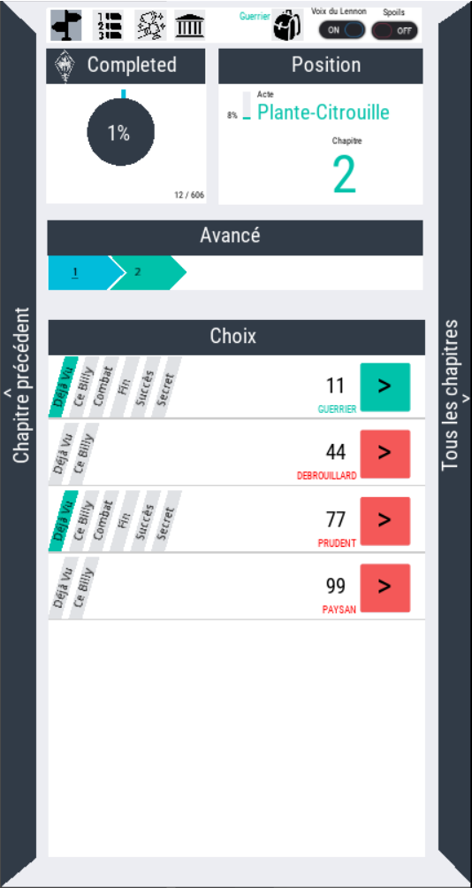

# fdcn

Application permettant de voir les chapitres du livre "La forteresse du Chaudron noir" de Bob Lennon

Elle est décomposée en deux parties:
* partie en Python reposant sur le fichier fdcn-1.json qui permet de générer:
  * l'image de tous les liens entre chapitre dans /graph
  * les fichiers nécessaires à la seconde partie
* une application (web, windows et surtout Android) en Godot permettant 
  * de suivre son avancée dans le livre
  * de savoir par quels chapitres il est déjà passé (ou pas)

Elle ressemble à ça :

### Confidentialité / Privacy
L'application ne récupère ni n'envoie d'informations des utilisateurs.

