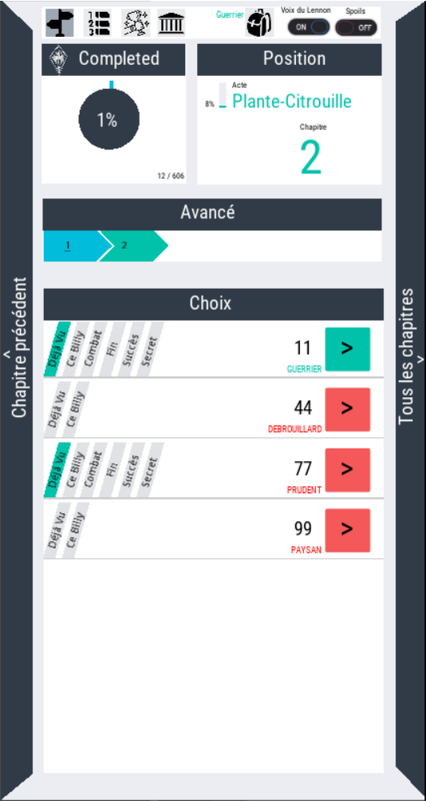

# fdcn

Application permettant de suivre sa progression dans les aventures de billy !. 
Actuellement, listés dans `books/books.json` :
* **La Forteresse du Chaudron Noir**
* **La Corne des Sables d'Ivoire**

Elle est décomposée en deux parties :
* une partie en Python (`scripts/`) qui lit la source de chaque livre dans
  `scripts/src/<nom>/`, la valide, et génère :
  * l'image de tous les liens entre chapitres (facultative, nécessite `graphviz`)
  * les fichiers que la seconde partie embarque, dans `books/<nom>/data/`
* une application (web, Windows et surtout Android) en Godot permettant :
  * de suivre son avancée dans le livre, y compris ses combats et ses succès
  * de savoir par quels chapitres il est déjà passé (ou pas)
  * de choisir entre les livres installés

Voir `scripts/README.md` pour le compilateur et `books/README.md` pour ajouter un livre.

Elle ressemble à ça :

### Confidentialité / Privacy
L'application ne récupère ni n'envoie d'informations des utilisateurs.

